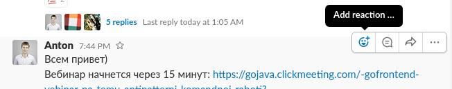
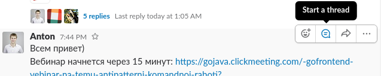
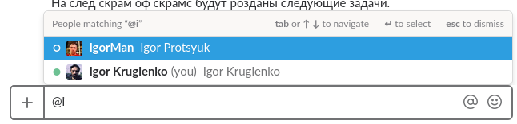
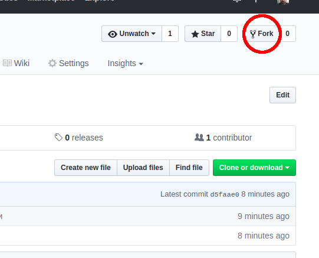
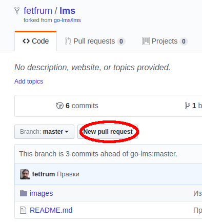

# GoIT Learninig management system

Небольшой гайд по взаимодействию между участниками проекта в GitHub и Slack.
## Обсуждение

* [Issues](https://github.com/go-lms/lms/issues)
* [Slack](https://lms-project-students.slack.com/messages)

## Рекомендации общения в Slack

1. Если вы видите в переписке какое-то объявление и собираетесь принять его в работу, то отмечайте это сообщение 
реакцией-символом "галочка". Так автор объявления и другие участники переписки поймут, кем принято в работу данное объявление. 
Чтобы проставить реакцию на сообщение, необходимо навести на данное сообщение курсор мыши и в всплывающем справа от сообщения 
тулбаре выбрать пункт "Add reaction", а потом выбрать соответствующий символ emoji (:white_check_mark:, "white_check_mark").

2. Если вы отвечаете на конкретное сообщение, то обязательно делайте это в thread данного сообщения. Данная рекомендация поможет избегать того, что переписка в Слэке превратится в флуд-помойку, а также предотвратит появление сообщений-сирот и неоднозначностей. Для этого нужно выбрать "Start a thread" (или "Reply to thead" для уже существующего треда).

3. Обращаясь к конкретному человеку, тегайте его никнеймом, а не реальным именем.Тогда ваш адресат получит уведомление, 
а также не будет путаницы с многочисленными тезками. Делается это просто: достаточно в поле набора сообщения поставить значек
коммерческого At (@, "собака) и Слэк предложит список участников воркспейса, в котором можно найти своего адресата.

## Как предложить изменение в данный репозиторий

Если вы хотите предложить изменения в данный документ, то следуйте, пожалуйста этой инструкции:

1. Делаем форк текущего репозитория:

2. Клонируем форкнутый репозиторий на локальный компьютер:

  ~~~
  git clone git@github.com:YOUR_GITHUB_NAME/lms.git .
  ~~~

3. Добавляем привязку удалённого репозитория:

  ~~~
  git remote add upstream git@github.com:go-lms/lms.git
  ~~~
  
4. Перед началом работы над локальной версией dru.io всегда забираем актуальную версию оригинального репозитория:

  ~~~
  git pull upstream master
  ~~~

5. Делаем правки

6. Коммитим правки:

  ~~~
  git add .
  git commit -am 'Commit message'
  ~~~

7. Отправляем коммит в свой удалённый репозиторий на Github:

  ~~~
  git push origin master
  ~~~

8. Переходим на Github и создаём Pull request
