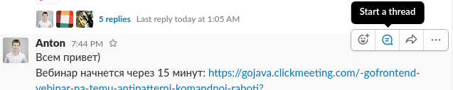
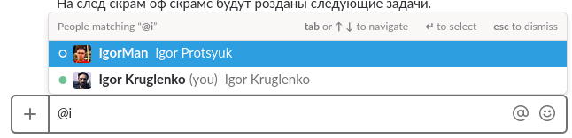
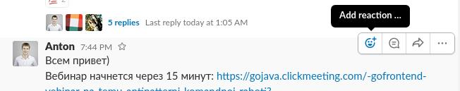

## Гайд по Slack для новичков

1. Вы могли уже заметить, что когда один из вас пишет в общий канал и хоть кто-то прочитает это сообщение, то для остальных перестает светиться напоминалочка “новое сообщение”. Для того, чтобы сообщение было прочитано всеми участниками канала 100 %, тегните всех учатников канала так @channel, и дальше пишите сообщение. В таком случае, сообщение будет прочтено абсолютно всеми участниками канала, поскольку будет гореть непрочитанное сообщение.

1. Альтернатива (не такая удобная, то тоже имеет место быть в некоторых жизненных ситуациях) - тег `@here`. Если вы напишите это в сообщение и отправите в общий чат, то сообщение будет гореть непрочитанным для всех участников канал, которые находятся сейчас онлайн. Это может быть полезно тогда, когда вопрос нужно решить немедленно, и тема потеряет свою актуальность позже.

1. Если в общем чате кто-то задал вопрос, который требует ответ, лучше отвечайте, используя thread. Что это значит? Наведите курсор на сообщение, и справа увидите 4 кнопки. Так вот вам нужна вторая: облачко с линиями. Таким образом, ваш ответ пойдет в ветку самого вопроса, а не в общий чат следующим сообщением. Такая мелочь способна упростить работы и усложнить ее. Так что Антон, Соня и Настя очень просят отвечать на вопросы в thread.


1. Бывает такое, что вам написал важное сообщение, и вы его прочитали. Но выполнить то, что написано в тексте, хотит позже. Боитесь забыть? Зажмите клавишу `Alt` и нажмите на сообщение. Оно станет непрочитанным и будет светиться вам, пока вы опять его не прочтете. Достаточно удобно)

1. Если нужно быстро найти какое-то сообщение, контакт или канал, воспользуйтесь глобальным поиском слака. Для этого нажмите `Ctrl+K`, и в поисковом запросе введите то, что вас интересует. Поиск будет произведен по всему слаку, полностью всему) Когда сообщений становится ну ооочень много, это незаменимый инструмент для экономии времени. (Единственная проблема — ограничение архива для бесплатных вокрспейсов Slack в 10K сообщений, свыше этого Slack архив не хранит. Так что для флуда с друзьями на отвлеченные темы лучше использовать другие мессенжеры, либо создавать новые воркспейсы)

1. Если вы пишите в общий чат (`#general`, например), то хотите обратиться к Антону, нужно не писать “Антон,...”, а тегнуть его) “`@Anton`,....”. В таком случае Антон увидит, что к нему обратились, и не пропустит ваш месседж. Как и любой другой член команды).


1. Если человека в вашем чате нет, а вам нужно знать его мнение, тоже самое: `@имя`. Человека сразу перекинет в ваш чат, ему будет доступна вся переписка.

1. Если вам прислали мега-полезное сообщение, и вы не хотите его потерять в общей ленте переписок, кликните на звездочку рядом со временем сообщения. И оно сохранится. Для того, чтобы открыть весь список сохраненных сообщений, в правом верхнем углу его такая же звезда, но побольше. Клик по ней переведет вас к вашему списку)

1. Для любителей писать красивые сообщения, выделяя главные слова жирным шрифтом, интересно будет узнать, что для того, чтобы выделить слово, нужно вокруг него поставить \*. То есть, \*привет\* - слово **привет** будет выделено жирным. Попробуйте)

1. Чтобы выделить слово курсивом, нужно вокруг него поставить \_. То есть, \_привет\_ - слово *привет* будет выделено италиком. 

1. Чтобы зачеркнуть слово, нужно вокруг него поставить знак тильды ~. То есть, ~привет~ - слово <s>привет</s> будет зачеркнуто. 

1. Код в строке можно выделить (с обеих сторон) знаком обратного акцента \` (этот символ там же где и тильда — слева сразу под Esc) или тремя обратными акцентами отдельным блоком. \`Code\` отобразится как `Code`, а 
\`\`\`
{
Некий длинный кусок кода
}
\`\`\` будет показан как
```
{
Некий длинный кусок кода
}
```
1. Если абзац начать знаком угловой закрывающей скобки >, то абзац будет выделен как цитатирование. Три таких символа вначале абзаца отметят как цитирование текст до конца вашего сообщения

1. А если нужно красиво оформить маркированный список, с кружочками, то зажмите `Alt` и введите `0149`, и появится черный кружочек • (буллет). Эта рекомендация актуальна для Windows, для macOS и Linux рекомендации другие: для macOS - комбинация `Option+8`, для Linux - `AltGr+8` (`AltGr` это _правый_ `Alt`) в *украинской* раскладке или   `Ctrl+Shift+U`, появится подчеркнутая `u`, после этого нужно ввести цифры 2022 и нажать `Enter`.

1. Представим: вы написали сообщение, отправили его, потом перечитали и увидели ошибку. Можно пойти длинным путем, а можно просто нажать на стрелочку вверх) И сразу отредактировать сообщение, исправить ошибку, и опять Enter. Но действие стрелочки вверх заканчивается через 5 минут после отправки сообщения. Так что спустя 5 минут - только длинный путь)

1. Если хотите пересмотреть все сообщения, на которых вас тегали, в правом верхнем углу, рядом со звездочкой, есть `@`. Она вам и нужна)

1. Для любителей максимальной кастомизации, в разделе `Preferences > Sidebar` Theme есть выбор тем.

1. Помимо этого, вы можете настроить уведомления исключительно по вашему усмотрению. Это могут быть уведомления о сообщениях, в которых к вам обратились, или уведомления о сообщениях с какими-то конкретными словами (список можно создать). Я такие списки пока не делала, но кому интересно, поиграть с настройками можно тут `Preferences > Notifications`.

1. Ну и еще один прикол - таск-менеджер (ха-ха). Своему слак-боту (он находится слева в контактах, самый первый) напишите `/remind` me in … minutes to ….. . И через указанное количество минут от слак-бота вам придет сообщение)
Пример: /remind me in 1 minute to sing. Через минуту мне придет от слак-бота такое сообщение: 
```[12:58] You asked me to remind you to “sing”.```
Вместо `me` можно тегнуть человека, кстати, используя `@`. Так что кто захочет пошутить над кем-то, вы знаете как это сделать)


###И ПОСЛЕДНЕЕ.
* Друзья, пожалуйста, когда мы делаем какое-то объявление, и вы его читаете, плюсуйте, пожалуйста) Можете ставить плюсик, смайлик или еще какие-то иконки. Так мы увидим от вас обратную связь, кто прочитал/принял к исполнению и т.д. А то сообщение в общую ветку написано, весь канал тегнут, а в ответ - 2 плюсика. Как сам с собой поговорил). Если вы видите в переписке какое-то объявление и собираетесь принять его в работу, то отмечайте это сообщение реакцией-символом "галочка" или другой символ. Так автор объявления и другие участники переписки поймут, кем принято в работу данное объявление. Чтобы проставить реакцию на сообщение, необходимо навести на данное сообщение курсор мыши и в всплывающем справа от сообщения тулбаре выбрать пункт `"Add reaction"`, а потом выбрать соответствующий символ emoji (:white_check_mark:, `white_check_mark`).


Заранее огромное спасибо)
